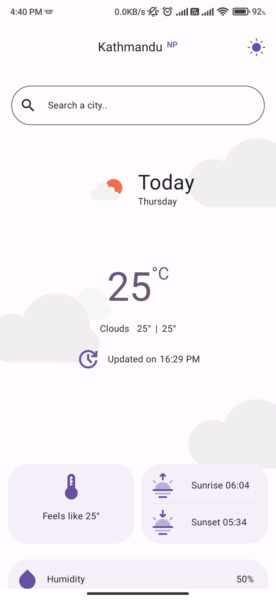

# Weather App

A sleek and modern weather application built using **Kotlin** and **Jetpack Compose** for Android, which provides both current and 5-day weather forecasts with an elegant UI. The app uses **Ktor** for network requests and fetches data from the **OpenWeather API**.

## Features

### Current Day Forecast
- **Temperature** (current, feels like, min/max).
- **Cloud cover** (e.g., clear, cloudy).
- **Sunrise & Sunset times**.
- **Humidity**.
- **Wind Speed** and **Wind Direction**.
- **Pressure**.
- **Visibility**.
- **Time of last update**.

### 5-Day Forecast
- Forecast data for the next 5 days.
- For each day, it shows:
    - **Day Name**.
    - **Temperature** (current, feels like).
    - **Humidity**.
    - **Wind Speed** and **Wind Direction**.

### UI & User Experience
- **Jetpack Compose** is used for building a modern, declarative UI.
- **Dark Mode Toggle**: Users can switch between light and dark themes via a button.
- **Lottie Animations** in the background that react to weather conditions (e.g., animated clouds when it's cloudy).

### API Integration
- Utilizes **OpenWeather API** to fetch weather data.
- Efficient **Ktor** HTTP client for network requests.

## Tech Stack

- **Programming Language**: Kotlin
- **UI Framework**: Jetpack Compose
- **API Integration**: Ktor
- **Weather API**: OpenWeather API
- **Lottie Animations**: For dynamic background effects based on weather conditions.
- **Dark Mode**: Toggleable button for switching between light and dark modes.


### Prerequisites

- **Android Studio** (latest stable version).
- **Kotlin** support (already included in Android Studio).
- **OpenWeather API Key** (you can get one by registering on the [OpenWeather website](https://openweathermap.org/api)).

### App Demo GIF
<p align="center">
  
</p>

### App Screenshots
<table>
  <tr>
    <td></td>
    <td></td>
  </tr>
  <tr>
    <td></td>
    <td></td>
  </tr>
  <tr>
    <td></td>
    <td></td>
  </tr>
  <tr>
    <td></td>
    <td></td>
  </tr>
</table>

### Setup Steps

1. Clone this repository:

   ```bash
   git clone https://github.com/dipeshmhrzn/weather-app.git

2. Open the project in Android Studio.
3. Create a file called **local.properties** in the project root directory if it doesn't already exist, and add your OpenWeather API key:

   ```bash
   WEATHER_API_KEY=your_openweather_api_key_here

4.Build and run the project on your Android device or emulator.

### Potential Improvements

- Incorporate geolocation to fetch weather based on the user's location.
- Add push notifications for weather updates.

## About Me

I am a Kotlin enthusiast currently learning Android Development with a focus on Jetpack Compose and Kotlin. I enjoy building apps that leverage modern Android technologies to create smooth and engaging user experiences.

Check out my other projects on my [GitHub profile](https://github.com/dipeshmhrzn).
